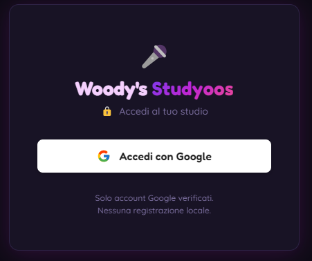
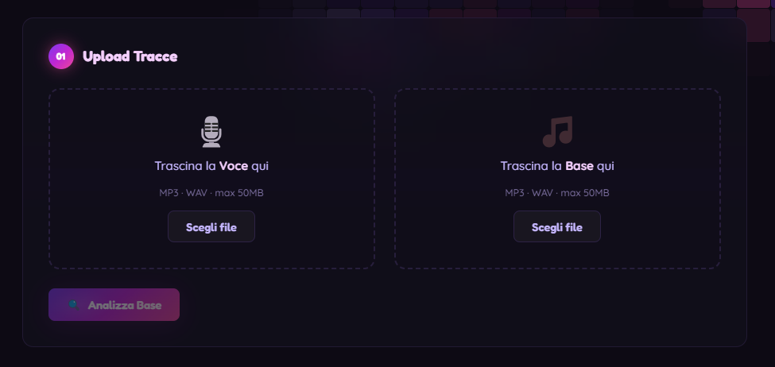
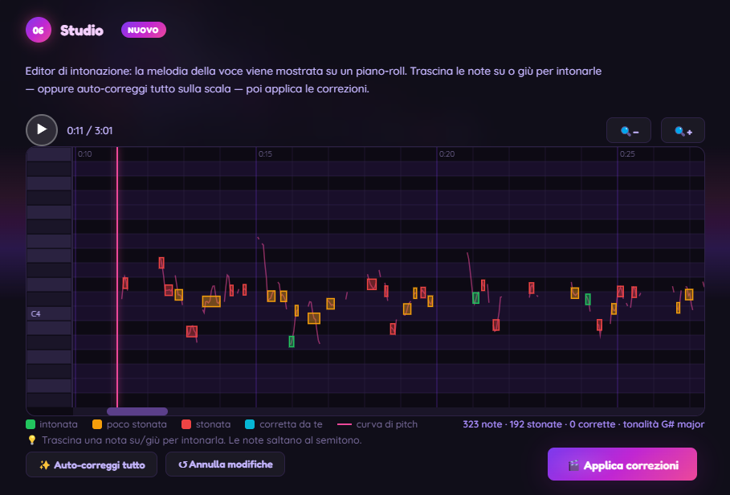
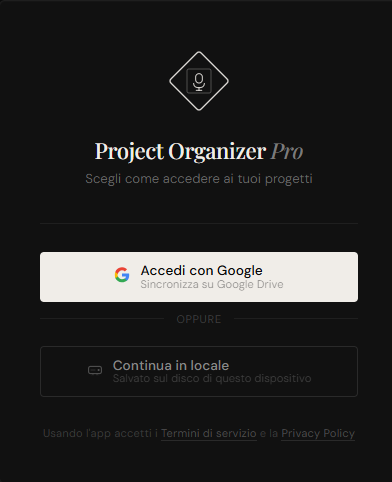
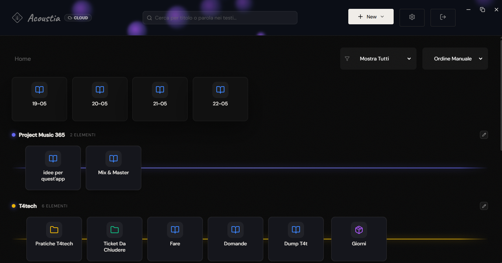
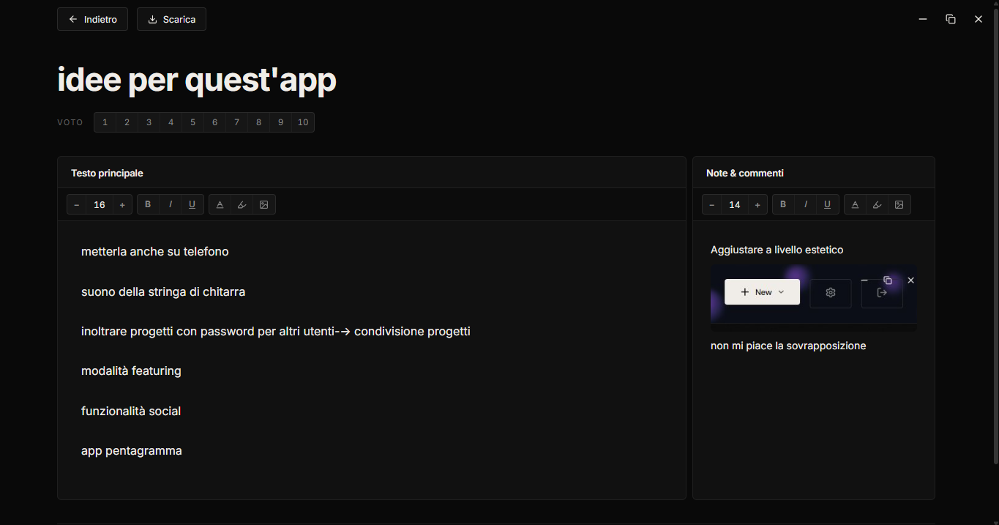
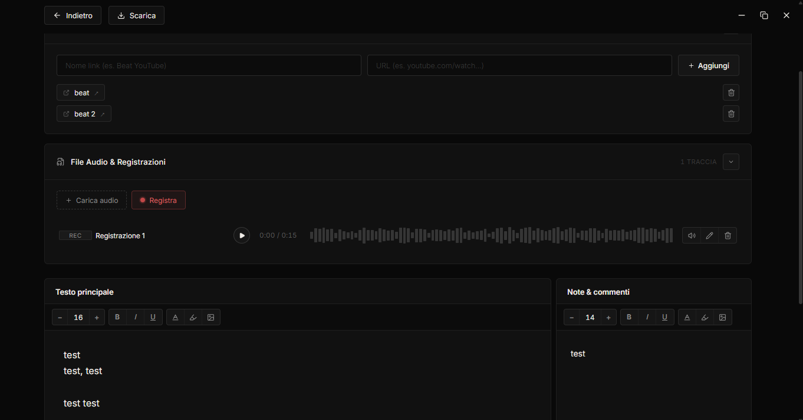

# Portfolio

> Showcase of my personal projects.
> Source code for the public ones is linked below; closed-source projects are documented in detail in the sections that follow.

## Public projects

- **[WinForge](https://github.com/LorenzoBoschi/WinForge)** — Automated Windows workstation provisioning tool.
- **[PCSnapshot](https://github.com/LorenzoBoschi/PCSnapshot)** — Zero-install Windows pre-migration system analyzer.

## Closed-source projects

### Studyoos

> Desktop voice processing studio for bedroom singers — drop in a vocal and a backing track, get pitch correction, cleanup, manual note editing, and a final mix, all offline.

<table>
<tr>
<td width="50%">

<p align="center"><i>Google OAuth completed inside the app window</i></p>
</td>
<td width="50%">

<p align="center"><i>Drop the voice and the backing track to start the pipeline</i></p>
</td>
</tr>
<tr>
<td width="50%">

<p align="center"><i>Cleanup parameters, autotune mode and live-preview controls</i></p>
</td>
<td width="50%">

<p align="center"><i>Studio piano-roll — notes colored by how off-pitch they are, drag to retune</i></p>
</td>
</tr>
</table>

#### Why this exists

Anyone who's recorded vocals at home knows the loop: the take is decent except for two flat notes and a sibilant "s" in the chorus. Fixing that means either accepting it, paying for a subscription autotune plugin, or wiring up Audacity with a chain of free effects that each handle one piece of the job badly.

Studyoos collapses the whole flow into one desktop app — key detection, six autotune modes, de-essing / noise reduction / gating, a piano-roll pitch editor for note-by-note manual surgery, and a mastered stereo mix at the end. No cloud, no subscription, no plugin chain. The unusual bit: it ships as a single Windows installer but under the hood it's an Electron shell driving an embedded Python 3.11 server, because the audio pipeline (CREPE neural pitch detection + Praat PSOLA resynthesis with formant preservation) lives in Python.

#### What it does

- Detects the musical key of the backing track via chroma correlation against Krumhansl-Kessler profiles, and suggests an autotune mode based on whether the key is major or minor.
- Six autotune modes — **Natural**, **Tight**, **Aesthetic / Trap**, **Vibrato Enhanced**, **Subtle Pitch Shift**, **Woody** (custom ondulation-boost) — each with its own retune-speed and flex-tune profile.
- Cleans the raw vocal with a multiband dynamic de-esser, spectral noise reduction, RMS gating, and a high-pass for plosives — each effect dialable independently.
- Studio piano-roll editor: the detected melody appears as draggable note blocks over the live pitch curve, with auto-correct-to-scale and a render step that PSOLA-shifts only the edited segments.
- Live-previews the autotuned voice as you adjust sliders (debounced re-render every 1.5s), mixes voice + backing track with mastering (EQ, reverb, sidechain ducking, peak normalization), exports WAV (16/24/32-bit) and MP3.
- Google OAuth completed inside the app window; auto-updates from a Cloudflare R2 bucket on launch.

#### Stack

`Electron 33 · Python 3.11 · Flask · librosa · torchcrepe · praat-parselmouth · pedalboard · noisereduce · electron-builder · electron-updater · NSIS · Cloudflare R2`

#### Notable technical choices

- **Embedded Python sidecar instead of a pure-Node app.** The audio stack lives in Python — `librosa`, `torchcrepe`, `praat-parselmouth`, `pedalboard` — and Node has nothing in that class. Electron's main process spawns Python as a child, polls `GET /login` until Flask answers 2xx, then shows the window. Production ships a Python embeddable in `extraResources/python/`; Flask only ever binds to `127.0.0.1`.

- **Google OAuth stealth via preload + Client Hints injection.** Google rejects OAuth from embedded webviews with `disallowed_useragent`. The fallback — opening OAuth in the system browser via a custom protocol handler — kills the UX. Instead the app fakes a real Chrome from three angles: `app.userAgentFallback` set to a Chrome 130 UA, a preload script (`contextIsolation=true`) rewriting `navigator.userAgentData` / `webdriver` / `window.chrome.runtime` / `navigator.plugins` before any page script runs, and `session.webRequest.onBeforeSendHeaders` injecting the full `Sec-CH-UA*` header set on Google-domain requests only.

- **Praat PSOLA for pitch shifting, not librosa's phase vocoder.** `librosa.effects.pitch_shift` uses time-stretching plus resampling, which destroys formants and makes voices sound chipmunky. `praat-parselmouth` wraps Praat's pitch-synchronous overlap-add: pitch marks placed on the signal are replayed at the target frequencies, and an LPC formant-preservation pass keeps timbre intact at larger shifts.

- **CREPE 'tiny' on CPU + pinned `numpy<2` / `torch<2.6`.** Pitch detection uses `torchcrepe.predict(model='tiny', device='cpu')` — far more robust than YIN on breathy vocals, no GPU required. Pins documented inline in `requirements.txt`: NumPy 2.x triggered a 2-3x slowdown in the `librosa`/`numba` audio path, and `torchaudio` references symbols across the 2.5→2.6 boundary that fail at import with `WinError 127: procedure not found` when mismatched with `torch`.

- **Concurrent-job semaphore + Server-Sent Events for progress.** Four parallel CREPE+PSOLA pipelines OOM a typical laptop. A small `acquire_job_slot` / `release_job_slot` pair caps live renders and returns HTTP 429 when full. Progress streams to the frontend on `/api/progress/<job_id>` as `text/event-stream` — picked over WebSockets (overkill) and polling (jittery).

- **Auto-update on Cloudflare R2, not GitHub Releases.** Source is closed and R2 has free egress. CI builds an NSIS installer with `electron-builder`, uploads the EXE + `latest.yml` + blockmap to R2 via the AWS CLI, and `electron-updater`'s `generic` provider points at the public R2 URL. A custom modal `BrowserWindow` shows real bytes/sec during download — `electron-updater`'s default UX shows nothing there.

#### Architecture overview

```
studyoos/
├── electron/
│   ├── main.js                 # spawns Python, manages window/tray/updater
│   ├── preload.js              # fakes Chrome fingerprint for Google OAuth
│   └── updater-progress.html   # modal with custom download progress bar
├── app.py                      # Flask: routes, OAuth, CSRF, job slots, SSE progress
├── security.py                 # session key, users.json, CSRF helpers
├── processing/
│   ├── analyze.py              # chromagram + Krumhansl-Kessler key detection
│   ├── cleanup.py              # multiband de-esser, noisereduce, gate, highpass
│   ├── autotune.py             # CREPE pitch + Praat PSOLA + 6 modes + Studio editor
│   └── mix.py                  # voice+base mix, EQ/reverb/sidechain, WAV+MP3
├── templates/index.html        # single-page UI, locked sections unlock as you advance
├── static/                     # main.js (SSE, live preview) + studio.js (piano-roll)
├── requirements.txt            # numpy<2, torch<2.6 pins documented inline
└── .github/workflows/build.yml # builds NSIS EXE, uploads to R2 + GH Releases
```

---

### Acoustia

> Desktop archive for songwriters and students — projects, audio takes, lyrics and study notes arranged on horizontal "guitar string" rows you can drag and color-tag.

<table>
<tr>
<td width="50%">

<p align="center"><i>Login — local mode or Google Drive sync</i></p>
</td>
<td width="50%">

<p align="center"><i>Main dashboard — projects arranged on horizontal "strings"</i></p>
</td>
</tr>
<tr>
<td width="50%">

<p align="center"><i>Study project — rich text body plus side notes</i></p>
</td>
<td width="50%">

<p align="center"><i>Music project — rich text, cover and audio takes in one view</i></p>
</td>
</tr>
</table>

#### Why this exists

If you write songs as a hobby, your "ideas" live in seven different places at once: lyric drafts in your phone's notes app, a voice memo called `idea_buona.m4a`, a chord chart screenshotted from YouTube, a half-finished bridge on the back of an envelope you can't find anymore. When you sit down two weeks later, you spend the first thirty minutes re-collecting your own work. The same shape of mess happens to students with reading notes and PDFs scattered across folders nobody remembers naming.

Acoustia folds both flows into one desktop app. Every "thing you're working on" is a project — rich text, side notes, optional cover image, inline images, and (for music projects) an audio panel with microphone recording and imported tracks. Projects live inside folders, and folders sit on horizontal **strings**: colored, draggable rows that let you arrange things spatially the way you'd arrange flashcards on a desk. The whole stack runs locally by default; cloud sync is opt-in and goes through the user's **own** Google Drive — no third-party server holds anyone's lyrics.

#### What it does

- **Two project types, same archive**: music projects (text + audio takes + cover) and "study" projects (text-only with the same rich editor).
- **Drag & drop everywhere**: re-arrange cards inside folders, drop them onto strings, drop image files into the rich-text editor, paste audio from the clipboard, drop a `.png` onto the cover picker.
- **In-place rename** of titles, section labels and string names — no extra "edit" modal for a name change.
- **Search across all project contents** — finds words inside bodies and side notes, accent-insensitive, even on projects buried in multiple folders.
- **Local-only or Google-Drive-synced** storage, with versioned recovery from Drive revisions and automatic backups every 6 hours into a rotating set of timestamped zip snapshots.
- **Multi-window**: `Ctrl+click` on a project opens it in its own window, with state synced between windows. Auto-updates via a generic update channel.

#### Stack

`Electron 41 · React 19 · Vite 8 · googleapis (Google Drive API) · framer-motion · lucide-react · JSZip · jsPDF · electron-builder (NSIS) · electron-updater (provider: generic → Cloudflare R2)`

#### Notable technical choices

- **Non-destructive merge on every Drive save.** A naïve cloud sync where each device writes the whole `data.json` blob silently amputates items added on another device since the cache was last refreshed — the classic "ghost project" race. The save handler reads Drive first and performs an additive merge: any `project_<id>` key present on Drive but missing locally is preserved, and any item still backed by a `project_<id>` is recovered before upload. Intentionally append-only so concurrent writes converge instead of overwriting. Trade-off: cross-device deletes need a follow-up tombstone mechanism — documented as a known limit rather than papered over.

- **`drive.file` scope over full `drive` scope.** `drive.file` only grants access to files the app itself created. Full `drive` would have simplified some queries but triggers Google's "sensitive scope" verification (3–6 weeks of review and a security questionnaire). With `drive.file` the OAuth consent screen passes lightweight verification and the app reaches non-test users without paperwork.

- **`http://127.0.0.1:<random-port>` OAuth callback over the deprecated `urn:ietf:wg:oauth:2.0:oob` flow.** Google deprecated the "out of band" desktop flow in 2022. Each login spins up an ephemeral `http.createServer()` on a free port, registers it as the redirect URI on the fly, and shuts it down as soon as the `code` query parameter arrives — no fixed port to fight with firewalls, no static redirect URI baked into the binary.

- **Bulk-load IPC for search indexing.** The first cut of global search lazy-loaded each project body per item — in cloud mode that meant downloading `data.json` from Drive `N` times. The current `load-all-project-contents` IPC reads `data.json` once, strips HTML in-memory, and returns a `{ [id]: { mainText, sideNotes } }` dictionary. First-search latency on a 30-project archive went from a noticeable freeze to imperceptible.

- **Legacy `app.setPath('userData', …)` after rebrand.** The product was renamed mid-lifecycle. Changing `productName` would have moved `app.getPath('userData')` to a new folder, orphaning every existing user's archive. A `setPath` call before any read pins the path to the original folder — invisible from outside, zero data loss.

- **electron-updater on Cloudflare R2 instead of GitHub Releases.** R2 with `provider: "generic"` gives a stable public URL with **zero egress fees** and is decoupled from the source-hosting platform. The build workflow uploads to **both** (GitHub Releases for manual download, R2 for the auto-updater) so the two channels degrade independently if either provider has an outage.

#### Architecture overview

```
acoustia/
├── electron/
│   ├── main.cjs               # window mgmt, IPC, Drive sync, OAuth, auto-update,
│   │                          # backup scheduler, conflict-aware save (~1500 lines)
│   └── preload.cjs            # contextBridge: storage, auth, sync, backup, window
├── src/
│   ├── App.jsx                # auth bootstrap + persistent <WindowControls/>
│   ├── components/
│   │   ├── Login.jsx          # local vs Google Drive choice
│   │   ├── Dashboard.jsx      # folders, strings, drag&drop, search, multi-window
│   │   ├── ProjectEditor.jsx  # music + study editor, audio recording, rich text
│   │   ├── WindowControls.jsx # custom min/max/close, fixed top-right
│   │   └── UpdateNotifier.jsx # update banner driven by electron-updater events
│   └── index.css
└── .github/workflows/build.yml # tag-triggered Win build → GitHub Releases + R2
```

User data lives under `%APPDATA%\<legacy-folder>\` with `data.json` (all projects), `audio\`, `covers\` and a rotating set of zip backups; in cloud mode the same tree is mirrored on Google Drive.
